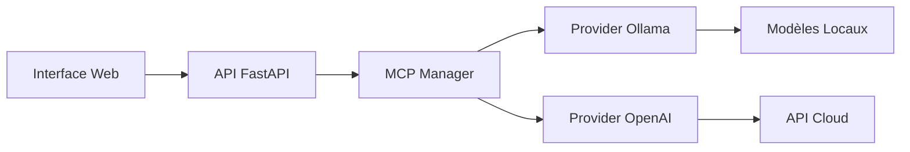

# EmoIA - Documentation MCP et Ollama

## 🚀 Vue d'ensemble

EmoIA intègre maintenant le **Model Context Protocol (MCP)** et **Ollama** pour offrir une expérience IA multi-modèles flexible et puissante.

## 📋 Table des matières

1. [Architecture MCP](#architecture-mcp)
2. [Intégration Ollama](#intégration-ollama)
3. [Guide de démarrage rapide](#guide-de-démarrage-rapide)
4. [Configuration des modèles](#configuration-des-modèles)
5. [API MCP](#api-mcp)
6. [Interface utilisateur](#interface-utilisateur)
7. [Développement](#développement)

## 🏗️ Architecture MCP

Le Model Context Protocol (MCP) permet à EmoIA d'utiliser différents modèles IA de manière transparente.

### Composants principaux

```
src/mcp/
├── __init__.py
├── mcp_manager.py      # Gestionnaire principal MCP
├── mcp_provider.py     # Classe de base pour les providers
├── mcp_client.py       # Client simplifié pour les interactions
└── providers/
    ├── ollama_provider.py    # Provider Ollama
    └── openai_provider.py    # Provider OpenAI (à venir)
```

### Flux de données



## 🦙 Intégration Ollama

Ollama permet d'exécuter des modèles IA open-source localement.

### Modèles supportés

- **Llama 2** : Modèle de dialogue performant
- **Mistral** : Modèle rapide et efficace
- **Phi** : Modèle compact pour tâches courantes
- **Gemma** : Modèle Google optimisé
- **Neural-chat** : Spécialisé dans la conversation

### Installation de nouveaux modèles

```bash
# Lister les modèles disponibles
docker exec emoia-ollama ollama list

# Installer un nouveau modèle
docker exec emoia-ollama ollama pull llama2:13b
docker exec emoia-ollama ollama pull codellama
docker exec emoia-ollama ollama pull mixtral
```

## 🚀 Guide de démarrage rapide

### 1. Démarrage avec Docker

```bash
# Donner les permissions d'exécution
chmod +x start_docker_enhanced.sh

# Démarrage en mode développement
./start_docker_enhanced.sh development

# Démarrage en mode production avec toutes les fonctionnalités
./start_docker_enhanced.sh production

# Démarrage avec monitoring
./start_docker_enhanced.sh monitoring
```

### 2. Vérification des services

```bash
# Vérifier Ollama
curl http://localhost:11434/api/tags

# Vérifier les providers MCP
curl http://localhost:8000/mcp/providers

# Lister les modèles disponibles
curl http://localhost:8000/mcp/models
```

### 3. Accès à l'interface

- **Frontend** : http://localhost:3000
- **API Docs** : http://localhost:8000/docs
- **Ollama API** : http://localhost:11434

## ⚙️ Configuration des modèles

### Configuration par défaut

```yaml
# config.yaml
mcp:
  default_provider: ollama
  providers:
    ollama:
      base_url: http://ollama:11434
      default_model: llama2
      timeout: 300
    openai:
      api_key: ${OPENAI_API_KEY}
      default_model: gpt-3.5-turbo
```

### Variables d'environnement

```bash
# .env
OLLAMA_BASE_URL=http://ollama:11434
MCP_DEFAULT_PROVIDER=ollama
OLLAMA_KEEP_ALIVE=24h
```

## 📡 API MCP

### Endpoints disponibles

#### Lister les providers
```http
GET /mcp/providers
```

Réponse :
```json
{
  "providers": {
    "ollama": {
      "name": "ollama",
      "capabilities": ["text-generation", "chat", "embeddings"],
      "default_model": "llama2",
      "status": "active"
    }
  }
}
```

#### Lister les modèles
```http
GET /mcp/models
```

#### Chat avec MCP
```http
POST /mcp/chat
Content-Type: application/json

{
  "user_id": "user123",
  "message": "Bonjour!",
  "provider": "ollama",
  "model": "llama2",
  "temperature": 0.7
}
```

#### WebSocket Streaming
```javascript
const ws = new WebSocket('ws://localhost:8000/ws/mcp');

ws.send(JSON.stringify({
  type: 'mcp_stream',
  provider: 'ollama',
  model: 'llama2',
  message: 'Raconte-moi une histoire'
}));
```

## 🎨 Interface utilisateur

### Composant ModelSelector

Le nouveau composant `ModelSelector` permet de :
- Visualiser tous les providers disponibles
- Sélectionner un modèle spécifique
- Voir les capacités de chaque provider
- Changer de modèle en temps réel

### Utilisation dans React

```typescript
import ModelSelector from './components/ModelSelector';

<ModelSelector 
  userId={userId}
  onModelChange={(provider, model) => {
    console.log(`Nouveau modèle: ${model} (${provider})`);
  }}
/>
```

## 🛠️ Développement

### Ajouter un nouveau provider

1. Créer une classe héritant de `MCPProvider` :

```python
from src.mcp.mcp_provider import MCPProvider

class MyProvider(MCPProvider):
    async def _setup(self):
        # Configuration du provider
        pass
    
    async def send_completion(self, model, messages, **kwargs):
        # Logique de complétion
        pass
    
    async def list_models(self):
        # Retourner la liste des modèles
        pass
```

2. Enregistrer le provider :

```python
# Dans mcp_manager.py
from .providers.my_provider import MyProvider

async def _load_default_providers(self):
    my_provider = MyProvider()
    await self.register_provider("myprovider", my_provider)
```

### Tests

```bash
# Tests unitaires MCP
pytest tests/test_mcp.py

# Tests d'intégration
pytest tests/test_mcp_integration.py
```

## 🔍 Monitoring et debugging

### Logs Ollama

```bash
# Voir les logs Ollama
docker logs emoia-ollama

# Suivre les logs en temps réel
docker logs -f emoia-ollama
```

### Métriques de performance

Avec le mode monitoring activé :
- **Prometheus** : http://localhost:9090
- **Grafana** : http://localhost:3001

Dashboards disponibles :
- Utilisation des modèles
- Temps de réponse par provider
- Taux d'erreur
- Utilisation mémoire/CPU

## 🚨 Troubleshooting

### Ollama ne démarre pas

```bash
# Vérifier l'état
docker ps -a | grep ollama

# Redémarrer le service
docker-compose restart ollama

# Vérifier les logs
docker logs emoia-ollama
```

### Modèles non disponibles

```bash
# Lister les modèles installés
docker exec emoia-ollama ollama list

# Installer manuellement un modèle
docker exec -it emoia-ollama ollama pull llama2
```

### Performance GPU

Pour utiliser le GPU avec Ollama :

```bash
# Vérifier la disponibilité GPU
docker run --rm --gpus all nvidia/cuda:11.5.0-base-ubuntu20.04 nvidia-smi

# Démarrer avec support GPU
docker-compose -f docker-compose.gpu.yml up
```

## 📚 Ressources

- [Documentation Ollama](https://ollama.ai/docs)
- [Model Context Protocol Spec](https://github.com/anthropics/model-context-protocol)
- [FastAPI WebSocket Guide](https://fastapi.tiangolo.com/advanced/websockets/)
- [React TypeScript Best Practices](https://react-typescript-cheatsheet.netlify.app/)

## 🤝 Contribution

Pour contribuer au développement MCP/Ollama :

1. Fork le repository
2. Créer une branche feature (`git checkout -b feature/nouveau-provider`)
3. Commiter vos changements
4. Push et créer une PR

---

Pour toute question ou problème, ouvrez une issue sur GitHub ou contactez l'équipe de développement.