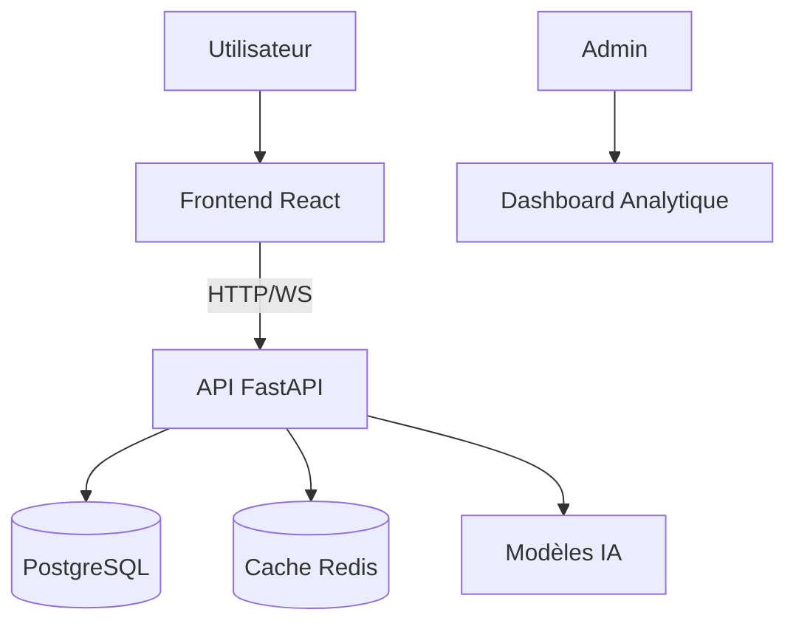
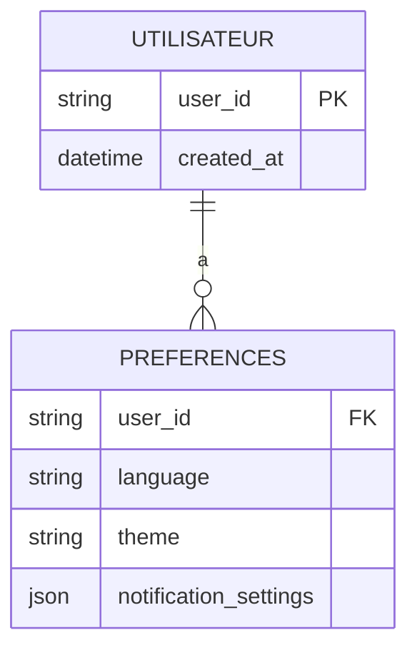

# Architecture Code La v3

## 1. Schéma Système


## 2. Spécifications API

### Nouveaux Endpoints
**GET `/langues`**  
Retourne les langues supportées :  
```json
{
  "langues": ["fr", "en", "es"]
}
```

**POST `/utilisateur/preferences`**  
Enregistre les préférences utilisateur :  
```json
{
  "user_id": "string",
  "language": "fr",
  "theme": "dark",
  "notification_settings": {}
}
```

### WebSocket Existant
**`/ws/chat`** ([src/core/api.py:56](src/core/api.py:56))  
Améliorations :  
- Ajouter le header `Accept-Language`
- Inclure la langue dans les métadonnées

## 3. Structure de Base de Données


## 4. Plan de Déploiement
- **Conteneurisation** : 
  - Dockerfile pour API Python
  - Dockerfile pour Frontend React
- **Orchestration** : 
  - AWS ECS avec Application Load Balancer
  - Tâches Fargate pour scalabilité
- **Base de Données** : 
  - AWS RDS PostgreSQL (prod)
  - SQLite (dev)
- **Monitoring** : 
  - CloudWatch pour les logs
  - X-Ray pour le tracing

## Prochaines Étapes
1. Implémenter le système de préférences
2. Ajouter la gestion multilingue backend
3. Configurer Docker et docker-compose
4. Développer le dashboard analytique complet